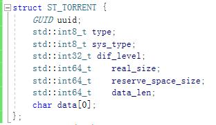

# KVM管理平台对VOI终端业务接口文档

### 一、接口文档说明
#### 1、通用报文:

#### 2、返回码表：

    | 返回码 | 含义 |
    | :--- | :--- |
    | 0     | 成功|
    | 60000 | 终端请求TOKEN错误 |
    | 60001 | 终端登录失败 |
    | 60002 | 终端没有登录 |
    | 60003 | 终端类型错误 |
    | 60004 | 终端序号错误 |
    | 60005 | 终端MAC错误 |
    | 60006 | 终端子网掩码错误 |
    | 60007 | 终端网关错误 |
    | 60008 | 终端域名解析地址错误 |
    | 60009 | 终端名称错误 |
    | 60010 | 终端CPU架构名称错误 |
    | 60011 | 终端软件版本错误 |
    | 60012 | 终端默认桌面模式类型错误 |
    | 60013 | 终端模式自动登录设置错误 |
    | 60014 | 终端连接服务器IP错误 |
    | 60015 | 终端配置版本号错误 |
    | 60016 | 终端重复登录错误 |
    | 60017 | 终端未链接 |
    | 60018 | 终端确认排序号小于起始编号 |
    | 60019 | 终端确认排序的MAC地址不在本次排序回话中 |
    | 60020 | 终端已经排完序号 |
    | 60021 | 终端未链接 |
    | 60022 | 用户名或密码错误 |
    | 60023 | BT响应报文错误 |
    | 60024 | 桌面信息不存在 |
    | 60025 | 终端记录不存在 |
    | 88888 | 报文错误，请修正重试 |
    | 99999 | 系统异常，请稍后重试 |
    | -1    | 未知异常 |

​       
#### 3、修改记录:
    20200513
    1、初始版本

****

#### 4、公共部分解释
	所有终端MAC地址都采用大写的冒号分隔格式如："AA:50:CC:C0:DD:08"
	
	通信协议报文头中service_code和下面所说的命令名称有对应关系
	{
		1000: "wakeup",
		1001: "shutdown",
		1002: "restart",
		1003: "delete",
		1004: "update_name",
		1005: "update_config",
		1006: "enter_maintenance_mode",
		1007: "clear_all_desktop",
		1008: "download_desktop",
		1009: "cancel_download_desktop",
		1010: "add_data_disk",
		1011: "order",
		1012: "update_ip",
		1013: "update_difference_disk",
		1014: "pxe_start",
		1015: "send_torrent",
		1016: "upload_desktop",
		1017: "send_desktop",
		1018: "push_task_result",  # 任务结果 {"torrent_id": "xxxxx", "msg": "Success","result": 0 }
								   # 任务结果 {"torrent_id": "xxxxx", "msg": "Fail","result": 1 }
	
		1019: "enter_maintain", # 进入维护模式
		1020: "upload_disk",
	
		1021: "bt_task_complete",  # bt任务完成通知
		1022: "watermark_switch",   # 水印开关通知
		1023: "ssh_upload_desktop",
		1024: "update_desktop_group_info",
		1025: "cancel_send_desktop",
	
		9000: "heartbeat",
		9001: "terminal_login",
		9002: "terminal_logout",
		9003: "get_date_time",
		9004: "get_config_version_id",
		9005: "get_config_info",
		9006: "update_config_info",
		9007: "get_desktop_group_list",
		9008: "verify_admin_user",
		9009: "order_confirm",
		9010: "order_query",
		9011: "sync_desktop_info",
		9012: "get_desktop_info",
		9013: "desktop_upload",
		9014: "torrent_upload",
		9015: "task_result",    # 上报任务结果
		9016: "operate_auth",
		9017: "init_desktop",   # 初始化桌面
		9018: "check_upload_state", # 校验
		9019: "bt_tracker",         # bt tracker地址
		9020: "p_to_v_start",          # p2v
		9021: "p_to_v_state",
		9022: "diff_disk_upload",
		9023: "diff_disk_download",
		9024: "desktop_login",
		9025: "bt_task_state",
		9026: "put_desktop_group_list",
		9027: "bt_upload_state",
        9028: "query_teach_pc",   #查询教师机
        9029: "update_performance",    # 上报终端性能信息
	}


​	

### 二、管理平台向终端发起请求的接口

#### 1、终端唤醒请求 ####
* 唤醒 请求/返回
	```
	终端开启网卡的唤醒功能，服务器发送UDP广播魔法包进行唤醒终端开机
	wol MAC-ADDR
	```

#### 2、终端关机/重启/删除/更新资源枚举信息 请求 ####
* 命令名称：shutdown/restart/delete/update_desktop_group_info/cancel_send_desktop

* server 请求/返回 body 
    ```
	{
		"batch_no": 66
	}
	
	{
      "code": 0,
      "msg": "Success",
	  "data": {
		"mac": "AA:50:CC:C0:DD:08",
		"batch_no": 66
	  }
	}
    ```
	* Parameters
    | 参数        | 描述                    | 必填 | 父级 | 数据类型 | 备注                                                     |
    | :---------- | :---------------------- | :--- | :--- | :------- | :------------------------------------------------------- |
    | mac     | MAC地址  | 是   |      | str      |                                   |
	| batch_no| 批次号        | 是   |	    |int	| 区分业务会话唯一性 |


#### 2、修改终端计算机名称请求 ####
* 命令名称：update_name

* server 请求/返回 body 
    ```
	{
		"batch_no": 66,
		"name": "PC-1",
		"conf_version": 16
	}
	
	{
      "code": 0,
      "msg": "Success",
	  "data": {
		"mac": "AA:50:CC:C0:DD:08",
		"batch_no": 66
	  }
	}
    ```

* Parameters
    | 参数        | 描述                    | 必填 | 父级 | 数据类型 | 备注                                                     |
    | :---------- | :---------------------- | :--- | :--- | :------- | :------------------------------------------------------- |
    | mac     | MAC地址  | 是   |      | str      |                                   |
    | name    | 终端名称 | 是   |      | str      | 最大长度13字节                    |
	| batch_no	  | 批次号        | 是   |	    |int	| 区分业务会话唯一性 |
	| conf_version	  | 配置版本号        | 是   |	    |int	| 用于终端版本同步 |


#### 3、修改终端配置请求 ####
* 命令名称：update_config

* server 请求/返回 body 
    ```
	{
		"batch_no": 66,
		"mode": {
			"show_desktop_type": 1,
			"auto_desktop": 0
		},
		"program": {
			"server_ip": "172.16.1.31"
		}
	}
	
	{
      "code": 0,
      "msg": "Success",
	  "data": {
		"mac": "AA:50:CC:C0:DD:08",
		"batch_no": 66
	  }
	}
    ```

* Parameters
    | 参数        | 描述                    | 必填 | 父级 | 数据类型 | 备注                                                     |
    | :---------- | :---------------------- | :--- | :--- | :------- | :------------------------------------------------------- |
    | mac               | MAC地址  | 是   |      | str      |                                   |
	| batch_no	  | 批次号        | 是   |	    |int	| 区分业务会话唯一性 |
    | mode              | 设置终端模式 | 是   |      | object      |                     |
	| show_desktop_type | 默认登录桌面类型 | 是   | mode | int      |                     |
	| auto_desktop      | 自动进入默认桌面 | 是   | mode | int      |  0-不进入 1-进入                   |
	| program           | 设置终端程序 | 是   |      | object      |                     |
	| server_ip         | 服务器连接IP地址 | 是   | mode | str      |                     |


#### 4、终端进入维护模式请求 ####
* 命令名称：enter_maintenance_mode

* server 请求/返回 body 
    ```
	{
		"batch_no": 66
	}
	
	{
      "code": 0,
      "msg": "Success",
	  "data": {
		"mac": "AA:50:CC:C0:DD:08",
		"batch_no": 66
	  }
	}
    ```
	
* Parameters
    | 参数        | 描述                    | 必填 | 父级 | 数据类型 | 备注                                                     |
    | :---------- | :---------------------- | :--- | :--- | :------- | :------------------------------------------------------- |
    | mac         | MAC地址  | 是   |      | str      |                                   |
	| batch_no	  | 批次号        | 是   |	    |int	| 区分业务会话唯一性 |


#### 5、终端清空所有桌面请求 ####
* 命令名称：clear_all_desktop

* server 请求/返回 body 
    ```
	{
		"batch_no": 66
	}
	
	{
      "code": 0,
      "msg": "Success",
	  "data": {
		"mac": "AA:50:CC:C0:DD:08",
		"batch_no": 66
	  }
	}
    ```
	
* Parameters
    | 参数        | 描述                    | 必填 | 父级 | 数据类型 | 备注                                                     |
    | :---------- | :---------------------- | :--- | :--- | :------- | :------------------------------------------------------- |
    | mac         | MAC地址  | 是   |      | str      |                                   |
	| batch_no	  | 批次号        | 是   |	    |int	| 区分业务会话唯一性 |


#### 6、下发桌面给终端请求 ####

* Parameters
    | 参数        | 描述                    | 必填 | 父级 | 数据类型 | 备注                                                     |
    | :---------- | :---------------------- | :--- | :--- | :------- | :------------------------------------------------------- |
    | mac         | MAC地址  | 是   |      | str      |                                   |
	| batch_no	  | 批次号        | 是   |	    |int	| 区分业务会话唯一性 |


* 命令名称：download_desktop

* server 请求/返回 body 
    ```
	{
		"batch_no": 66,
		"desktop": {
		    // 桌面名称
		    "name": "desktop_name",
		    // 桌面描述
		    "desc" : "qq",
		    // 差分模式，0-不合并，1-合并
		    "diff_mode": 0,
			// 桌面uuid
			"uuid": "f15a1759-789e-4e17-a3e1-e723121e9314",
			// 系统类型， 
			"sys_type": 1, // "windows_7_x64": 1,"windows_7" : 2,  "windows_10": 3, "Other": 0,
			// 桌面磁盘文件列表
			"disks": [
				{"uuid":"91f9d1ba-cb4a-41ba-971a-618f9e306571",
                  // 磁盘类型， 0 - 系统盘， 1 - 数据盘 2 - 共享盘
				  "type":0,
				  "dif_level":1,
				  // 磁盘文件名称前缀 
				  "prefix": "voi",
				  // 操作id base - 0 , 其他累加
				  "operate_id": 0,  
				  "real_size":8888888888,
				  "reserve_space":8888888888
				},
				{"uuid":"92f9d1ba-cb4a-41ba-971a-618f9e306571", 
				  "type":1,
				  "dif_level":1,
				  // 操作id base - 0 , 其他累加
				  "operate_id": 0,  
				  "real_size":8888888888,
				  "reserve_space":8888888888
				},
			],
		}
	}
	
	{
      "code": 0,
      "msg": "Success",
	  "data": {
		"mac": "AA:50:CC:C0:DD:08",
		"batch_no": 66
	  }
	}
    ```

#### 7、下发桌面取消请求 ####
* 命令名称：cancel_download_desktop

* server 请求/返回 body 
    ```
	{
		"batch_no": 66,
		"mac": "00:50:56:C0:00:08",
		"desktop_name1": "http://172.16.1.33/vm_dir/desktop_name1.qcow2",
		"desktop_name2": "http://172.16.1.33/vm_dir/desktop_name2.qcow2",
		"desktop_name3": "http://172.16.1.33/vm_dir/desktop_name3.qcow2",
	}
	
	{
      "code": 0,
      "msg": "Success",
	  "data": {
		"mac": "AA:50:CC:C0:DD:08",
		"batch_no": 66
	  }
	}
    ```
	
#### 8、终端添加数据盘请求 ####
* 命令名称：add_data_disk

* server 请求/返回 body 
    ```
	{
		"batch_no": 66,
		"enable": 1,
		"restore": 1,
		"size": 8,
	}
	
	{
      "code": 0,
      "msg": "Success",
	  "data": {
		"mac": "AA:50:CC:C0:DD:08",
		"batch_no": 66
	  }
	}
    ```
	
* Parameters
    | 参数        | 描述                    | 必填 | 父级 | 数据类型 | 备注                                                     |
    | :---------- | :---------------------- | :--- | :--- | :------- | :------------------------------------------------------- |
	| batch_no	  | 批次号        | 是   |	    |int	| 区分业务会话唯一性 |
    | mac         | MAC地址       | 是   |      | str      |                                   |
    |enable		  | 是否启用标识  | 是   |	    |int	|：0-不启用， 1-启用|
    |restore	  | 是否还原标识  | 是   |		|int	|：0-不还原， 1-还原|
    |size		  | 数据盘大小    | 是   |		|int	| 单位G|
	
#### 9、终端序号排序请求 ####
* 命令名称：order

* server 请求/返回 body 
    ```
	{
		"batch_no": 1,
		"terminal_id": 11,
	}
	
	{
      "code": 0,
      "msg": "Success",
	  "data": {
		"mac": "AA:50:CC:C0:DD:08",
		"batch_no": 1
	  }
	}
    ```
	
* Parameters
    | 参数        | 描述                    | 必填 | 父级 | 数据类型 | 备注                                                     |
    | :---------- | :---------------------- | :--- | :--- | :------- | :------------------------------------------------------- |
    | mac         | MAC地址       | 是   |      | str      |                                   |
    | batch_no	  | 批次号        | 是   |	    |int	| 区分业务会话唯一性 |
    | terminal_id | 排序终端号码  | 是   |		|int	| 当前排序的终端号码,返回-1表示排序结束、终端需要退出排序界面|
	
	
#### 10、终端修改IP地址请求 ####
* 命令名称：update_ip

* server 请求/返回 body 
    ```
	{
		  "batch_no": 66,
          "ip": "172.16.1.20",
          "mask": "255.255.255.0",
          "gateway": "172.16.1.254",
          "dns1": "8.8.8.8",
          "dns2": "114.114.114.114",
		  "conf_version": 16
	}
	
	{
      "code": 0,
      "msg": "Success",
	  "data": {
		"mac": "AA:50:CC:C0:DD:08",
		"batch_no": 66
	  }
	}
    ```

* Parameters
    | 参数        | 描述                    | 必填 | 父级 | 数据类型 | 备注                                                     |
    | :---------- | :---------------------- | :--- | :--- | :------- | :------------------------------------------------------- |
    | mac         | MAC地址       | 是   |      | str      |                                   |
    | ip          | IP地址        | 是   |      | str      |                                   |
	| mask        | 子网掩码      | 是   |      | str      |                                   |
	| gateway     | 网关地址      | 是   |      | str      |                                   |
	| dns1        | 域名解析地址1 | 是   |      | str      |                                   |
	| dns2        | 域名解析地址2 | 是   |      | str      |                                   |
    | batch_no	  | 批次号        | 是   |	    |int	| 区分业务会话唯一性 |
	| conf_version	  | 配置版本号        | 是   |	    |int	| 用于终端版本同步 |


#### 11、更新磁盘请求(合并差异磁盘、删除多余差异磁盘等操作) ####
* 命令名称：update_difference_disk

* server 请求/返回 body 
    ```
	{
		"batch_no": 66,
		"disk_info_list": [
			{
				"name": "disk_version_1",
				"uuid": "234124234123413234123412",
				"version": 5,
				"download_url": "http://172.16.1.33/voi_disk_image/win7_template_5.qcow2"
			},
			{
				"name": "disk_version_2",
				"uuid": "23412423412342222223412",
				"version": 6,
				"download_url": "http://172.16.1.33/voi_disk_image/win7_template_6.qcow2"
			},
		]
	}
	
	{
      "code": 0,
      "msg": "Success",
	  "data": {
		"mac": "AA:50:CC:C0:DD:08",
		"batch_no": 66
	  }
	}
    ```

#### 12、下发网络引导启动请求 ####
* 命令名称：pxe_start

* server 请求 body 
    ```
	{
		"batch_no": 66
	}
	
	{
      "code": 0,
      "msg": "Success",
	  "data": {
		"mac": "AA:50:CC:C0:DD:08",
		"batch_no": 66
	  }
	}
    ```
	
### 三、终端向管理平台发起请求的接口		

#### 1、心跳请求 ####
* 命令名称：heartbeat

* client 请求/返回 body 
    ```
	{
		"mac": "00:50:56:C0:00:08"
	}
	
	{
      "code": 0,
      "msg": "Success",
	  "data": {
		"datetime": "2020-04-02 09:22:33"
	  }
	}
	```

#### 2、终端登录/登出 请求 ####
* 命令名称：terminal_login/terminal_logout (用于建立/释放终端socket连接和mac地址映射关系)

* client 请求/返回 body 
    ```
	{
		"mac": "00:50:56:C0:00:08",
		"ip": "172.16.1.33"
	}
	
	{
      "code": 0,
      "msg": "Success",
      "data": {
		"token": "20200402222223333333333333"
	  }
	}
	```

#### 3、终端获取服务器系统时间请求 ####
* 命令名称：get_datatime

* client 请求/返回 body 
    ```
	{
		"mac": "00:50:56:C0:00:08"
	}
	
	{
      "code": 0,
      "msg": "Success",
	  "data": {
		"datetime": "2020-04-02 09:22:33"
	  }
	}
	```

#### 4、终端获取终端配置版本号请求 ####
* 命令名称：get_config_version_id

* client 请求/返回 body 
    ```
	{
		"mac": "00:50:56:C0:00:08",
		"resolutions" : "800*600;1920*1080" 
	}
	
	{
      "code": 0,
      "msg": "Success",
	  "data": {
		"conf_version": 22
	  }
	}
	```
* Parameters
    | 参数        | 描述                    | 必填 | 父级 | 数据类型 | 备注                                                     |
    | :---------- | :---------------------- | :--- | :--- | :------- | :------------------------------------------------------- |
    | conf_version  | 配置版本号       | 是   |      | int      |                                   |
	
#### 5、终端获取终端配置信息请求 ####
* 命令名称：get_config_info

* client 请求/返回 body 
    ```
	{
		"mac": "00:50:56:C0:00:08"
	}
	
	{
      "code": 0,
      "msg": "Success",
	  "data": {
		"terminal_id": 1,
		"mac": "00:50:56:C0:00:08",
		"name": "PC-1",
		"ip": "172.16.1.25",
		"is_dhcp": 0,
		"mask": "255.255.255.0",
		"gateway": "172.16.1.1",
		"dns1": "8.8.8.8",
		"dns2": "114.114.114.114",
		"platform": "x86",
		"soft_version": "2.2.2",
		"conf_version": 12,
		"disk_residue": 5.92,
		"setup_info": {
			"mode": {
				"show_desktop_type": 0, 
				"auto_desktop": 0
			},
			"program": {
				"server_ip": "172.16.1.29",
				"screen_resolution" : "800*600",
				"resolutions" : "800*600;1920*1080" 
			}
		}
	  }
	}
	```
* Parameters
    | 参数        | 描述                    | 必填 | 父级 | 数据类型 | 备注                                                     |
    | :---------- | :---------------------- | :--- | :--- | :------- | :------------------------------------------------------- |
    | terminal_id  | 终端序号          | 是   |data    | int      |                                   |
	| mac          | 终端MAC地址       | 是   |data    | str      |                                   |
    | name         | 终端名称          | 是   |data    | str      |                                   |
	| ip           | 终端IP地址        | 是   |data    | str      |                                   |
	| is_dhcp      | DHCP启动          | 是   |data    | int      | 0-不启动 1-启动                   |
	| mask         | 子网掩码          | 是   |data    | str      |                                   |
    | gateway      | 网关地址          | 是   |data    | str      |                                   |
	| dns1         | 域名解析地址1     | 是   |data    | str      |                                   |
    | dns2         | 域名解析地址2     | 是   |data    | str      |                                   |
	| platform     | 终端CPU架构类型   | 是   |data    | str      | x86/arm                           |
	| soft_version | 终端程序版本      | 是   |data    | str      | 例如："2.2.2.1"                   |
	| conf_version | 终端配置版本号    | 是   |data    | int      |                                   |
	| disk_residue | 磁盘剩余容量      | 是   |data    | float    |                                   |
	| setup_info   | 设置信息          | 是   |data    | object   |                                   |
	| mode         | 设置模式          | 是   |setup_info | object|                                   |
	| show_desktop_type| 显示默认桌面类型  |是|mode    | int      |                                   |
	| auto_desktop | 自动进入桌面      | 是   |mode    | int      |                                   |
	| program      | 设置程序          | 是   |setup_info | object|                                   |
	| server_ip    | 终端管理服务地址  | 是   |program    | str   |                                   |
	
	
#### 6、终端更新服务器端终端配置信息请求 ####
* 命令名称：update_config_info

* client 请求/返回 body 
    ```
	{
		"terminal_id": 1,
		"mac": "00:50:56:C0:00:08",
		"name": "PC-1",
		"ip": "172.16.1.25",
		"is_dhcp": 0,
		"mask": "255.255.255.0",
		"gateway": "172.16.1.1",
		"dns1": "8.8.8.8",
		"dns2": "114.114.114.114",
		"platform": "x86",
		"soft_version": "2.2.2",
		"conf_version": 12,
		"disk_residue": 5.92,
		"setup_info": {
			"mode": {
				"show_desktop_type": 2, 
				"auto_desktop": 0
			},
			"program": {
				"server_ip": "172.16.1.29",
				"screen_resolution" : "800*600"
			}
		}
	}
	
	{
      "code": 0,
      "msg": "Success"
	}
	```
* Parameters
    | 参数        | 描述                    | 必填 | 父级 | 数据类型 | 备注                                                     |
    | :---------- | :---------------------- | :--- | :--- | :------- | :------------------------------------------------------- |
    | terminal_id  | 终端序号          | 是   |data    | int      |                                   |
	| mac          | 终端MAC地址       | 是   |data    | str      |                                   |
    | name         | 终端名称          | 是   |data    | str      |                                   |
	| ip           | 终端IP地址        | 是   |data    | str      |                                   |
	| is_dhcp      | DHCP启动          | 是   |data    | int      | 0-不启动 1-启动                   |
	| mask         | 子网掩码          | 是   |data    | str      |                                   |
    | gateway      | 网关地址          | 是   |data    | str      |                                   |
	| dns1         | 域名解析地址1     | 是   |data    | str      |                                   |
    | dns2         | 域名解析地址2     | 是   |data    | str      |                                   |
	| platform     | 终端CPU架构类型   | 是   |data    | str      | x86/arm                           |
	| soft_version | 终端程序版本      | 是   |data    | str      | 例如："2.2.2.1"                   |
	| conf_version | 终端配置版本号    | 是   |data    | int      |                                   |
	| disk_residue | 磁盘剩余容量      | 是   |data    | float    | 单位是GB                          |
	| setup_info   | 设置信息          | 是   |data    | object   |                                   |
	| mode         | 设置模式          | 是   |setup_info | object|                                   |
    | show_desktop_type| 显示默认桌面类型  |是|mode    | int      | 0-教学桌面、1-个人桌面、2-混合桌面|
    | auto_desktop | 自动进入桌面      | 是   |mode    | int      | 0-不自动进入、1 自动进入桌面      |
	| program      | 设置程序          | 是   |setup_info | object|                                   |
	| server_ip    | 终端管理服务地址  | 是   |program    | str   |                                   |
	                                  |
	
	
#### 7、终端获取资源枚举列表请求 ####
* 命令名称：get_desktop_group_list

* client 请求/返回 body 
    ```
	{
		"mac": "00:50:56:C0:00:08",
		"ip": "192.169.1.33",
	}
	
	{
      "code": 0,
      "msg": "Success",
	  "data": {
		"desktop_group_list": [
			{
				"desktop_group_name": "桌面组名称1",
				"desktop_group_uuid": "f15a1759-789e-4e17-a3e1-e723121e9314",
				"default_desktop_group": true,
				"os_sys_type":1,
				"desktop_group_desc": "桌面组描述",
				"desktop_group_status": 0, 
				"desktop_group_restore": 0, 
				"show_desktop_info": 1,
				"auto_update_desktop": 0,
				"desktop_name": "桌面名称",
				"template_name": "ysr_template_6",
				"template_updated_time": "2020-07-27 17:36:35",
				"desktop_is_dhcp": 1,
				"desktop_ip": "192.168.1.33",
				"desktop_mask": "255.255.255.0",
				"desktop_gateway": "192.168.1.254",
				"desktop_dns1": "8.8.8.8",
				"desktop_dns2": "114.114.114.114",
				// 差分模式，0-不合并，1-合并
		        "diff_mode": 0,
				"disks": [
					{
						"uuid":"91f9d1ba-cb4a-41ba-971a-618f9e306571", 
						"type":1,
						"dif_level":1,
						"prefix": "voi",
						// 操作id base - 0 , 其他累加
				        "operate_id": 0,  
						"real_size": "8888888888",
						"reserve_size" : "50"
					},
					{
						"uuid":"92f9d1ba-cb4a-41ba-971a-618f9e306571", 
						"type":1,
						"dif_level":1,
						"prefix": "voi",
						// 操作id base - 0 , 其他累加
				        "operate_id": 1,  
						"real_size": "8888888888",
						"reserve_size" : "50"
					},
					{
						"uuid":"91f9d1ba-cb4a-41ba-971a-618f9e306571", 
						"type":1,
						"dif_level":1,
						"prefix": "voi",
						// 操作id base - 0 , 其他累加
				        "operate_id": 0,  
						"real_size": "8888888888",
						"reserve_size" : "50"
					}
				]	
			},
			{
				"desktop_group_name": "桌面组名称2",
				"desktop_group_uuid": "f15a1759-789e-4e17-a3e1-e723121e9344",
				"default_desktop_group": true,
				"os_sys_type":1,
				"desktop_group_desc": "桌面组描述",
				"desktop_group_status": 1, 
				"desktop_group_restore": 0, 
				"show_desktop_info": 1,
				"auto_update_desktop": 0,
				"desktop_name": "桌面名称",
				"template_name": "ysr_template_6",
				"template_updated_time": "2020-07-27 17:36:35",
				"desktop_is_dhcp": 0,
				"desktop_ip": "192.168.1.33",
				"desktop_mask": "255.255.255.0",
				"desktop_gateway": "192.168.1.254",
				"desktop_dns1": "8.8.8.8",
				"desktop_dns2": "114.114.114.114",
				// 差分模式，0-不合并，1-合并
		        "diff_mode": 0,
				"disks": [
					{
						"uuid":"91f9d1ba-cb4a-41ba-971a-618f9e306571", 
						"type":1,
						"dif_level":1,
						"prefix": "voi",
						"max_dif": 1,				# 该类型磁盘最大差分
						"real_size": "8888888888",
						"reserve_size" : "50"
					},
					{
						"uuid":"92f9d1ba-cb4a-41ba-971a-618f9e306571", 
						"type":1,
						"dif_level":1,
						"max_dif": 1,
						"prefix": "voi",
						"real_size": "8888888888",
						"reserve_size" : "50"
					},
					{
						"uuid":"91f9d1ba-cb4a-41ba-971a-618f9e306571", 
						"type":2,
						"dif_level":1,
						"max_dif": 1,
						"prefix": "voi",
						"real_size": "8888888888",
						"reserve_size" : "50",
						"restore_flag" : 1
					}
				]	
			}
		]
	}
	```
	
* Parameters
    | 参数        | 描述                    | 必填 | 父级 | 数据类型 | 备注                                                     |
    | :---------- | :---------------------- | :--- | :--- | :------- | :------------------------------------------------------- |
    | desktop_group_list  | 桌面组列表       | 是   |      | array      |                         |
    | desktop_group_name  | 桌面组名称       | 是   |      | str      |                                   |
	| default_group       | 默认桌面组       | 是   |      | bool      |  用于终端自动进入默认桌面的策略                             |
    | desktop_group_desc  | 桌面组的描述     | 是   |      | str      |                                 |
	| desktop_group_uuid  | 桌面组UUID       | 是   |      | str      |                                   |
    | desktop_group_staus | 桌面组状态       | 是   |      | int      |   0-未激活 1-激活                                |
	| desktop_group_restore | 桌面组还原状态 | 是   |      | int      |   0-不还原 1-还原                                |
	| show_desktop_info   | 是否显示桌面信息 | 是   |      | int      |   0-不显示 1-显示， 终端表现为桌面上显示水印信息        |
	| auto_update_desktop | 是否自动更新桌面 | 是   |      | int      |   0-不自动 1-自动， 上层客户端是否自动更新桌面          |
	| desktop_name        | 桌面名称         | 是   |      | str      |         |
	| template_name        | 模板名称        | 是   |      | str      |         |
	| template_updated_time| 模板更新时间    | 是   |      | str      |         |
	| desktop_is_dhcp     | 桌面IP获取是否启用DHCP | 是   |      | int      | 0-静态IP 1-DHCP 如果是dhcp情况下，桌面ip信息是无效的，可以不解析 |
	| desktop_ip          | 桌面IP地址       | 是   |      | str      |         |
	| desktop_mask        | 桌面IP的子网掩码 | 是   |      | str      |         |
	| desktop_gateway     | 桌面IP的网关地址 | 是   |      | str      |         |
	| desktop_dns1        | 桌面域名解析服务器地址1         | 是   |      | str      |         |
	| desktop_dns2        | 桌面域名解析服务器地址2   | 是   |      | str      |  可能为空       |
	| os_sys_type         | 操作系统名称     | 是   |      | int      | 0-other 1-windows_7_x64, 2-windows_7_x32, 3-windows_10,        |
	| diff_mode         | 差分合并模式 | 是   |      | int      | // 差分模式，0-不合并，1-合并|
	| disks               | 桌面磁盘列表     | 是   |  desktop_group_list    | array      | 每个桌面默认有三个磁盘：系统盘、数据盘、共享盘        |
	| uuid                | 磁盘UUID         | 是   |  disks    | str      |  |
	| type                | 磁盘类型         | 是   |  disks    | int      | 0-系统磁盘 1-数据磁盘 2-共享磁盘  |
	| dif_level           | 磁盘差分等级     | 是   |  disks    | 0-base盘 4-差分4 5-差分5，最多有两个差分磁盘文件      |  |
	| max_dif             | 最大差分	| 是|	disks | int |  
	| prefix              | 磁盘文件名前缀   | 是   |  disks    | str      | 磁盘文件名组成："prefix"_"dif_level"_"uuid" |
	| real_size           | 磁盘qcow文件实际大小| 是   |  disks    | str      | 单位为512-字节块大小(扇区大小) |
	| reserve_size        | 磁盘qcow文件解析virtual_size大小  | 是   |  disks    | str      | 单位为GB512-字节块大小(扇区大小) |
	| restore_flag        | 共享盘磁盘清空与不清空标识  | 是   |  disks    | int      | 0-不清空 1-清空  |
    | operate_id          | 操作版本号 | 是   |disks    | int   | base盘为0， 其他累加|  
    

#### 8、终端验证用户密码请求(管理平台的用户) ####
* 命令名称：verify_admin_user

* client 请求/返回 body 
    ```
	{
		"mac": "00:50:56:C0:00:08",
		"user_name": "zhangsan",
		"password": "123456"
	}
	
	{
      "code": 0,
      "msg": "Success"
	}
	```
* Parameters
    | 参数        | 描述                    | 必填 | 父级 | 数据类型 | 备注                                                     |
    | :---------- | :---------------------- | :--- | :--- | :------- | :------------------------------------------------------- |
    | user_name   | 用户名称       | 是   |      | str      |                                   |
    | password    | 用户密码       | 是   |      | str      |                                   |


#### 9、终端序号排序确认请求 ####
* 命令名称：order_confirm
	
* client 请求/返回 body 
    ```
    {
        "mac": "00:50:56:C0:00:08",
        "batch_no": 1,
		"terminal_id": 11,
    }

    {
      "code": 0,
      "msg": "Success"
    }
    ```

* Parameters
    | 参数        | 描述                    | 必填 | 父级 | 数据类型 | 备注                                                     |
    | :---------- | :---------------------- | :--- | :--- | :------- | :------------------------------------------------------- |
    | mac         | MAC地址       | 是   |      | str      |                                   |
    | batch_no	  | 批次号        | 是   |	    |int	| 区分排序回话唯一性 |
    | terminal_id | 排序终端号码  | 是   |		|int	| 当前排序的终端号码|


#### 10、终端序号排序查询请求 ####
* 命令名称：order_query
	
* client 请求/返回 body 
    ```
    {
        "mac": "00:50:56:C0:00:08"
    }

    {
      "code": 0,
      "msg": "Success",
	  "data": {
		"batch_no": 1,
		"terminal_id": 11
	  }
    }
    ```

* Parameters
    | 参数        | 描述                    | 必填 | 父级 | 数据类型 | 备注                                                     |
    | :---------- | :---------------------- | :--- | :--- | :------- | :------------------------------------------------------- |
    | mac         | MAC地址       | 是   |      | str      |                                   |
    | batch_no	  | 批次号        | 是   |	    |int	| 区分排序回话唯一性 |
    | terminal_id | 排序终端号码  | 是   |		|int	| terminal_id == -1 的时候，表示没有在排序|


#### 11、上层客户端-在线状态 ###------------客户端发起
	 client 请求/返回 body
``` {  }

```
* return:
``` {  }

```


​	
#### 12、上层客户端-信息同步 ####------------客户端发起

* 命令名称: sync_desktop_info

* client 请求/返回 body

```json
{
    "uuid": "f15a1759-789e-4e17-a3e1-e723121e9314",
    "sys_type":1,
    "name": "桌面名称",
    "desc": "描述",
    "disks": [
        {
            "uuid":"91f9d1ba-cb4a-41ba-971a-618f9e306571", 
            "type":1,
            "dif_level":1, 
            "prefix": "voi",
            "real_size":8888888888
        },
        {
            "uuid":"92f9d1ba-cb4a-41ba-971a-618f9e306571", 
        	"type":1,
        	"dif_level":1,
        	"prefix": "voi",
        	"real_size":8888888888
    	}
    ]
		
}
```

* return:
```
  {
      "code": 0,
      "msg": "Success"
  }
```

#### 13、上层客户端-上传指令 ####------服务端发起

* client 请求/返回 body

``` {
		"desktop": {
			"uuid": "f15a1759-789e-4e17-a3e1-e723121e9314",
			"sys_type":1,
			"name": "桌面名称",
			"desc": "描述",
			"disks": [
				{
				  "uuid":"91f9d1ba-cb4a-41ba-971a-618f9e306571", 
				  "type":1,
				  "dif_level":1,
				  "prefix": "voi",
				  "real_size":8888888888
				}
			]
		}
	}
```

* return:
```
  {
      "code": 0,
      "msg": "Success"
  }
```


#### 14、上层客户端 - 种子文件上传 ####------客户端发起

* 命令名称: torrent_upload

* client 请求/返回 body  二进制数据 种子描述结构体 + 文件内容


```


{
    "desktop_uuid": "f15a1759-789e-4e17-a3e1-e723121e9314",
    "uuid":"92f9d1ba-cb4a-41ba-971a-618f9e306571", 
    "type":1,
    "sys_type":1,
    "dif_level":1,
    "real_size":8888888888,
    "torrent_file": "VOI_1_92f9d1ba-cb4a-41ba-971a-618f9e306571.torrent",
    "data_len":87666,
    "data":""
}
```
* return:
```
  {
      "code": 0,
      "msg": "Success"
  }
```


#### 15、上层客户端-推送种子 ####------服务端发起,客户端保存
  * 命令名称: torrent_upload

* client 请求/返回 body  二进制数据 种子描述结构体 + 文件内容


```


{
    "desktop_uuid": "f15a1759-789e-4e17-a3e1-e723121e9314",
    "uuid":"92f9d1ba-cb4a-41ba-971a-618f9e306571", 
    "type":1,
    "sys_type":1,
    "dif_level":1,
    "real_size":8888888888,
    "torrent_file": "VOI_1_92f9d1ba-cb4a-41ba-971a-618f9e306571.torrent",
    "data_len":87666,
    "data":""
}
```
* return:
```
  {
      "code": 0,
      "msg": "Success"
  }
```


#### 16、上层客户端 - 客户端下载完成反馈 ####

* 命令名称: task_result

* client 请求/返回 body

```
{
	"name":"voi_1_92f9d1ba-cb4a-41ba-971a-618f9e306571"
}
```
* return:
```
  {
      "code": 0,
      "msg": "Success"
  }
```


#### 17、上层客户端 - 服务端下载完成反馈 ####

* 命令名称: task_result

* client 请求/返回 body

```
{
	"name":"voi_1_92f9d1ba-cb4a-41ba-971a-618f9e306571"
}
```
* return:
```
  {
      "code": 0,
      "msg": "Success"
  }
```


#### 18、上层客户端 - 密码校验请求

* 命令名称: operate_auth

* client 请求/返回 body

```
{
	"account": "user1",
	"password": "voi_test1"
}
```

* return:
```
  {
      "code": 0,
      "msg": "Success"
  }
```

#### 19、上报当前桌面信息 ### 客户端发起

* 命令名称: upload_desktop_info

* client 请求/返回 body

```
{
	"boot_disk": "voi_0_92f9d1ba-cb4a-41ba-971a-618f9e306571"
}
```

* return:
```
  {
      "code": 0,
      "msg": "Success",
      "desktop": {
			"uuid": "f15a1759-789e-4e17-a3e1-e723121e9314",
			"sys_type":1,
			"disks": [
				{"uuid":"91f9d1ba-cb4a-41ba-971a-618f9e306571", 
				  "type":1,
				  "dif_level":1,
				   "prefix": "voi",
				  "real_size":8888888888
				},
				{"uuid":"92f9d1ba-cb4a-41ba-971a-618f9e306571", 
				  "type":1,
				  "dif_level":1,
				  "prefix": "voi",
				  "real_size":8888888888
				}
			]
		}
  }
```


#### 20、检查模板是否可以更新差分盘
* 命令名称: check_upload_state

* client 请求/返回 body

```
{
	"mac": "00:50:56:C0:00:08",
	"desktop_group_uuid": "f15a1759-789e-4e17-a3e1-e723121e9314"
}
```

* return:
```
  {
      "code": 0,
      "msg": "Success",
	  "data": {
		"can_update": 0 // 0 - 不能， 1 - 能
	  }
  }
```

#### 21、终端开始上传虚拟磁盘镜像文件

* 命令名称: p_to_v_start

* client 请求/返回 body

```
{
	"mac": "AA:50:CC:C0:DD:08",
	"template_name": "ysr_template",
	"template_desc": "add qq soft",
	"classify": 1, # 1-教学桌面 2-个人桌面（目前固定为1）
	"system_disk": {
		"size": 100, # size 分区划分的大小，大小的单位全部为GB
		"real_size": 8.5
	},
	"data_disks": [
		{
			"size": 100,
			"read_size": 8.5
		},
		{
			"size": 100,
			"read_size": 8.5
		}
	]
}
```

* return:
```
  {
      "code": 0,
      "msg": "Success",
      "data": {
			"image_names": "voi_0_92f9d1ba-cb4a-41ba-971a-618f9e306571,voi_0_88f9d1ba-cb4a-41ba-971a-618f9e306571,voi_0_99f9d1ba-cb4a-41ba-971a-618f9e306571",
			"user": "root",
			"password": "123qwe,.",
			"storage": "opt"
		}
  }
```


#### 21、终端上传虚拟磁盘镜像文件进度

* 命令名称: p_to_v_end_state

* client 请求/返回 body

```
{
	"os_type": "windows_7_x64",  # "windows_10_x64" "windows_7" "windows_10" "other"
	"image_name": "voi_0_92f9d1ba-cb4a-41ba-971a-618f9e306571"
	"progress": 11,
	"status": 0,  # 0-异常 1-正常
	"mac": "AA:50:CC:C0:DD:08",
	"storage": "opt",
}
```

* return:
```
  {
      "code": 0,
      "msg": "Success"
  }
```

#### 22、终端差分磁盘镜像文件上传请求

* 命令名称: diff_disk_upload

* client 请求/返回 body

```
{
	"mac": "AA:50:CC:C0:DD:08",
	"desktop_group_uuid": "92f9d1ba-cb4a-41ba-971a-2222222222",
	"diff_disk_uuid": "92f9d1ba-cb4a-41ba-971a-618f9e306571",
	"diff_level": 2
}
```

* return:
```
  {
      "code": 0,
      "msg": "Success"
  }
```

#### 22、终端差分磁盘镜像文件下载请求

* 命令名称: diff_disk_download

* client 请求/返回 body

```
{
	"mac": "AA:50:CC:C0:DD:08",
	"desktop_group_uuid": "92f9d1ba-cb4a-41ba-971a-2222222222",
	"diff_disk_uuid": "92f9d1ba-cb4a-41ba-971a-618f9e306571",
	"diff_level": 3
}
```

* return:
```
  {
      "code": 0,
      "msg": "Success"
  }
```


#### 23、上层WINDOWS客户端登录桌面请求

* 命令名称: desktop_login

* client 请求/返回 body

```
{
	"mac": "AA:50:CC:C0:DD:08",
	"desktop_group_uuid": "92f9d1ba-cb4a-41ba-971a-2222222222",
	"is_dhcp": 1,
	"ip": "192.168.1.13",
	"netmask": "255.255.255.0",
	"gateway": "192.168.1.254",
	"dns1": "114.114.114.114",
	"dns2": "8.8.8.8"
}
```

* return:
```
  {
      "code": 0,
      "msg": "Success"
  }
```

#### 24、终端上报bt文件下载进度

* 命令名称: bt_task_state

* client 请求/返回 body

```
{
       "torrent_name": xxxxxxx,
       "mac": "xxxxxxxxxx",
       "progress": 11,
       "state": "finished" #  "downloading", "seeding"
}
```

* return:
```
  {
      "code": 0,
      "msg": "Success"
  }
```


#### 25、终端上报本地桌面组数量

* 命令名称: put_desktop_group_list

* client 请求/返回 body

```
{
       "sys_disk_uuids": "111111111111,222222222222,3333333333333",
       "mac": "00:0C:29:51:B1:DF"
}
```

* return:
```
  {
      "code": 0,
      "msg": "Success"
  }
```


#### 26、终端获取上传进度及速度

* 命令名称: bt_upload_state

* client 请求/返回 body

```
{
       "torrent_name": xxxxxxx,
       "mac": "xxxxxxxxxx"
}
```

* return:
```
  {
      "code": 0,
      "msg": "Success",
      "data": {
            "progress": 11,
            "rate" : 10, 
            "state": "finished" #  "downloading", "seeding"
      }
  }
```


### 27、修改教学终端配置

* 命令名称: query_teach_pc

* client 请求/返回 body
    ```
	{
		"room_num": 2,
	}

	{
      "code": 0,
      "msg": "Success",
	}
	```
 * Parameters
    | 参数        | 描述                    | 必填 | 父级 | 数据类型 | 备注                                                     |
    | :---------- | :---------------------- | :--- | :--- | :------- | :------------------------------------------------------- |
    | is_exist    | 是否存在教师机          | 是   |      | str      | is_exist==1表示存在教师机，is_exist==0表示不存在教师机   |
    
    
   
### 28、上报终端性能信息

* 命令名称：update_performance

* client 请求/返回 body
    ```json
  	{
		"mac": "xxxxxxxxxx",
        "data": {
            "name": "Sensors",
            "count": "6",
            "desc": [{
                "name": "Intel Xeon E5-2680 v2 (/intelcpu/0)",
                "count": "2",
                "desc": [{
                    "Name": "CPU Core",
                    "Value": "0",
                    "Min": "0",
                    "Max": "0",
                    "Path": "(/intelcpu/0/clock/1)"
                }, {
                    "Name": "CPU Core",
                    "Value": "58.3333",
                    "Min": "58.3333",
                    "Max": "100",
                    "Path": "(/intelcpu/0/load/1)"
                }]
            }, {
                "name": "Intel Xeon E5-2680 v2 (/intelcpu/1)",
                "count": "2",
                "desc": [{
                    "Name": "CPU Core",
                    "Value": "0",
                    "Min": "0",
                    "Max": "0",
                    "Path": "(/intelcpu/1/clock/1)"
                }, {
                    "Name": "CPU Core",
                    "Value": "78",
                    "Min": "78",
                    "Max": "100",
                    "Path": "(/intelcpu/1/load/1)"
                }]
            }, {
                "name": "Generic Hard Disk (/hdd/0)",
                "count": "1",
                "desc": [{
                    "Name": "Used Space",
                    "Value": "67.753",
                    "Min": "67.753",
                    "Max": "67.753",
                    "Path": "(/hdd/0/load/0)"
                }]
            }, {
                "name": "Generic Hard Disk (/hdd/2)",
                "count": "1",
                "desc": [{
                    "Name": "Used Space",
                    "Value": "0.0971618",
                    "Min": "0.0971618",
                    "Max": "0.0971618",
                    "Path": "(/hdd/2/load/0)"
                }]
            }, {
                "name": "Unknown (/mainboard)",
                "count": "0",
                "desc": []
            }, {
                "name": "Generic Memory (/ram)",
                "count": "3",
                "desc": [{
                    "Name": "Memory",
                    "Value": "92.217",
                    "Min": "92.217",
                    "Max": "92.217",
                    "Path": "(/ram/load/0)"
                }, {
                    "Name": "Used Memory",
                    "Value": "7.37341",
                    "Min": "7.37341",
                    "Max": "7.37341",
                    "Path": "(/ram/data/0)"
                }, {
                    "Name": "Available Memory",
                    "Value": "0.622307",
                    "Min": "0.622307",
                    "Max": "0.622307",
                    "Path": "(/ram/data/1)"
                }]
            }]
        }
	}

	{
      "code": 0,
      "msg": "Success",
	}
    ```